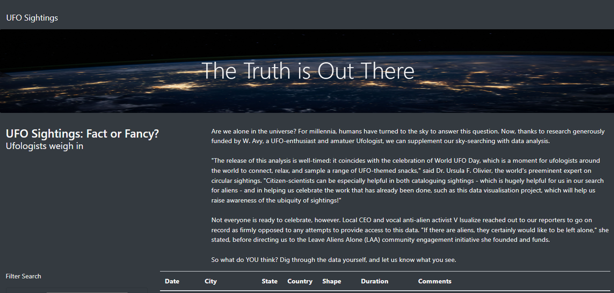
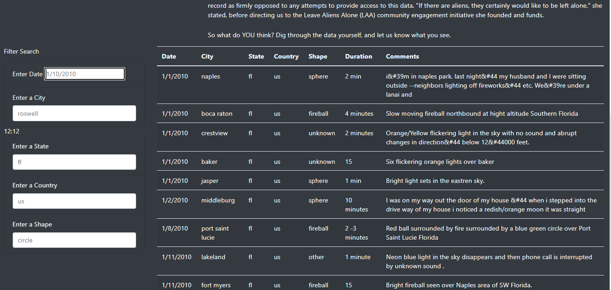

# UFOs

## Purpose
The objective for this analysis was to provide users with filters to search for multiple criteria’s at once. The filters will sort by city, date, country, state, and shape.

## Results
Upon entrance to our website, the user will observe the following: 

 

From there if the user desires, they will be able to use the filters on the left-hand side. They can search for any state, city, country, etc. The results will yield on the right-hand side. This also includes duration amount and comments made from the sightings.

## Summary
Although this website allows the users to filter and gather information quickly, it does have some drawbacks. For example, the website doesn't have information past 2010 which may be a negative for some clients who like to stay up-to-date on UFO sightings. In addition to this, I think capitalizing state, country, shape, and city names will make the website look more reputable. I would also add videos and images attached alongside each sighting so the users experience will be enhanced.